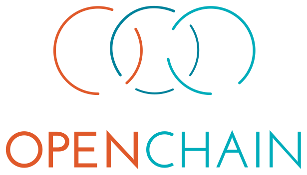

# NOTE: This is a reference machine translation. It will be reviewed and corrected by the community. You can be part of this - participate in our community from this link:
[https://openchainproject.org/participate](https://openchainproject.org/participate)

OpenChain ISO/IEC 18974 Checkliste zur Selbstzertifizierung
Der einfache Weg zur Konformitätsprüfung
Generation 2 - Version 1
18.08.2025

Einleitung
OpenChain ISO/IEC 18974 ist der Internationale Standard für die Open-Source-Sicherheitsgewährleistung. ISO/IEC 18974 hilft Organisationen, Open Source auf bekannte Sicherheitsschwachstellen wie CVEs, GitHub-Abhängigkeitswarnungen oder Paketmanager-Warnungen zu überprüfen.

Ihre Organisation kann sich selbst als konform mit OpenChain ISO/IEC 18974 zertifizieren. Dies ist so einfach wie die Beantwortung aller Fragen im Online-Formular mit „Ja“. Wenn eine Organisation nicht alle Fragen mit „Ja“ beantworten kann, erfüllt sie die Anforderungen des Standards noch nicht.

Bitte beachten Sie, dass dies eine Selbstzertifizierung ist und Sie und Ihre Organisation allein für die Richtigkeit der nachstehenden Aussagen verantwortlich sind.

Sie haben auch die Möglichkeit, diese Checkliste online auszufüllen:
https://openchainproject.org/checklist-iso-5230-2020

Die Checkliste zur Selbstzertifizierung
Abschnitt 4.1.1
[ ] Wir verfügen über eine dokumentierte Richtlinie, die die Open-Source-Sicherheitsgewährleistung der bereitgestellten Software regelt.

[ ] Wir verfügen über ein dokumentiertes Verfahren, um allen Programmteilnehmern die Existenz der Open-Source-Richtlinie mitzuteilen.

Abschnitt 4.1.2
[ ] Wir haben die Rollen und Verantwortlichkeiten identifiziert, die die Leistung und Wirksamkeit des Programms beeinflussen.

[ ] Wir haben die für jede Rolle erforderlichen Kompetenzen identifiziert und dokumentiert.

[ ] Wir haben eine Liste der Programmteilnehmer identifiziert und dokumentiert und wie sie ihre jeweiligen Rollen ausfüllen.

[ ] Wir haben die bewertete Kompetenz für jeden Programmteilnehmer dokumentiert.

[ ] Wir haben eine Möglichkeit, regelmäßige Überprüfungen und Änderungen unserer Prozesse zu dokumentieren.

[ ] Wir haben eine Möglichkeit zu überprüfen, ob unsere Prozesse mit den aktuellen Best Practices und den Personalzuweisungen des Unternehmens übereinstimmen.

Abschnitt 4.1.3
[ ] Unsere Programmteilnehmer kennen die Richtlinie zur Open-Source-Sicherheitsgewährleistung und wissen, wo sie zu finden ist.

[ ] Unsere Programmteilnehmer kennen die relevanten Open-Source-Ziele.

[ ] Unsere Programmteilnehmer sind sich der Beiträge bewusst, die zur Gewährleistung der Wirksamkeit des Programms erwartet werden.

[ ] Unsere Programmteilnehmer sind sich der Konsequenzen bewusst, die eine Nichteinhaltung der Programmanforderungen mit sich bringt.

Abschnitt 4.1.4
[ ] Wir verfügen über eine schriftliche Erklärung, die den Umfang und die Grenzen des Programms klar definiert.

[ ] Wir verfügen über eine Reihe von Metriken zur Messung der Programmleistung.

[ ] Wir verfügen über dokumentierte Nachweise aus jeder Überprüfung, Aktualisierung oder jedem Audit, um eine kontinuierliche Verbesserung nachzuweisen.

Abschnitt 4.1.5
[ ] Wir verfügen über eine Methode zur Identifizierung von strukturellen und technischen Bedrohungen für die bereitgestellte Software.

[ ] Wir verfügen über eine Methode zur Erkennung bekannter Schwachstellen in der bereitgestellten Software.

[ ] Wir verfügen über eine Methode zur Nachverfolgung identifizierter bekannter Schwachstellen.

[ ] Wir verfügen über eine Methode, um identifizierte bekannte Schwachstellen bei Bedarf an den Kundenstamm zu kommunizieren.

[ ] Wir verfügen über eine Methode zur Analyse der bereitgestellten Software auf neu veröffentlichte bekannte Schwachstellen nach der Veröffentlichung der bereitgestellten Software.

[ ] Wir verfügen über eine Methode, bei der vor der Veröffentlichung für die gesamte bereitgestellte Software kontinuierliche und wiederholte Sicherheitstests durchgeführt werden.

[ ] Wir verfügen über eine Methode, um zu überprüfen, ob identifizierte Risiken vor der Veröffentlichung der bereitgestellten Software behoben wurden.

[ ] Wir verfügen über eine Methode, um Informationen über identifizierte Risiken gegebenenfalls an Dritte zu exportieren.

Abschnitt 4.2.1
[ ] Wir verfügen über eine Methode, die es Dritten ermöglicht, Anfragen zu bekannten Schwachstellen oder neu entdeckten Schwachstellen zu stellen (z. B. über eine E-Mail-Adresse oder ein Webportal, das von Programmteilnehmern überwacht wird).

[ ] Wir verfügen über ein internes dokumentiertes Verfahren zur Beantwortung von Anfragen Dritter zu bekannten Schwachstellen oder neu entdeckten Schwachstellen.

Abschnitt 4.2.2
[ ] Wir haben die mit dem Programm verbundenen Personen, Gruppen oder Funktionen dokumentiert.

[ ] Wir haben sichergestellt, dass die identifizierten Programmrollen angemessen besetzt und ausreichend finanziert sind.

[ ] Wir haben sichergestellt, dass Fachwissen zur Behebung identifizierter bekannter Schwachstellen verfügbar ist.

[ ] Wir verfügen über ein dokumentiertes Verfahren, das interne Verantwortlichkeiten für die Sicherheitsgewährleistung zuweist.

Abschnitt 4.3.1
[ ] Wir verfügen über ein dokumentiertes Verfahren, das sicherstellt, dass die gesamte in der bereitgestellten Software verwendete Open-Source-Software über den gesamten Lebenszyklus der bereitgestellten Software kontinuierlich erfasst wird. Dies schließt ein Archiv der gesamten in der bereitgestellten Software verwendeten Open-Source-Software ein.

[ ] Wir verfügen über Aufzeichnungen der Open-Source-Komponenten für die bereitgestellte Software, die belegen, dass das dokumentierte Verfahren ordnungsgemäß befolgt wurde.

Abschnitt 4.3.2
[ ] Wir verfügen über ein dokumentiertes Verfahren für die Erkennung und Behebung bekannter Schwachstellen in den Open-Source-Softwarekomponenten der bereitgestellten Software.

[ ] Wir verfügen über Aufzeichnungen der Open-Source-Komponenten für die bereitgestellte Software, die identifizierte bekannte Schwachstellen und die ergriffenen Maßnahmen (auch wenn keine Maßnahme erforderlich war) nachverfolgen.

Abschnitt 4.4.1
[ ] Wir verfügen über eine Dokumentation, die bestätigt, dass das Programm alle Anforderungen dieser Spezifikation erfüllt.

Abschnitt 4.4.2
[ ] Wir verfügen über eine Dokumentation, die bestätigt, dass die Programmkonformität innerhalb der letzten 18 Monate überprüft wurde.

Nächste Schritte
Haben Sie sich nach dieser Spezifikation selbst zertifiziert? Sie können uns dies unter diesem Link mitteilen:
https://openchainproject.org/conformance-submission

Wir würden Ihre Organisation gerne in unsere Liste der konformen Organisationen (Community of Conformance) auf der Website des OpenChain-Projekts aufnehmen. Dies ist optional, aber es ist eine großartige Möglichkeit, die Einführung in der gesamten Lieferkette zu fördern.